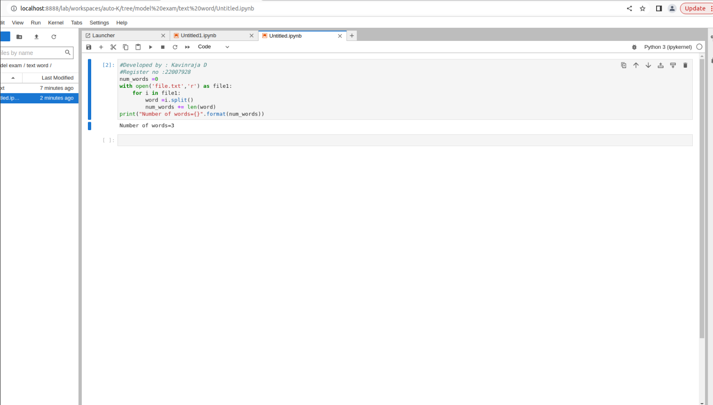

# Word-count
## AIM:
To write a python program for getting the word count from a text.
## EQUIPEMENT'S REQUIRED: 
PC
Anaconda - Python 3.7
## ALGORITHM: 
### Step 1:
Declare number of words is 0

### Step 2: 

 Now open it with text file
 
### Step 3: 

add the range for variable i

### Step 4:  

Then next split the words given

### Step 5: 

Count the number of words there

### Step 6: 

At last add the print statement 

## PROGRAM:
```
num_words =0
with open('text.txt','r') as file1:
 for i in file1:
 word =i.split()
 num_words += len(word)
print("Number of words={}".format(num_words))
```

### OUTPUT:




## RESULT:
Thus the program is written to find the word count from a text.
